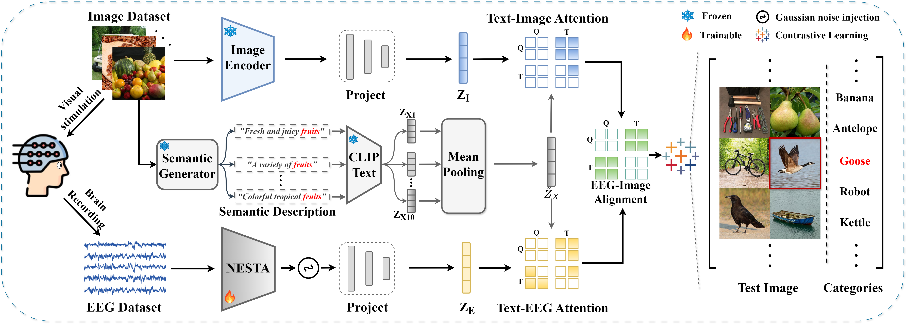

# Neural-MCRL: Neural Multimodal Contrastive Representation Learning for EEG-based Visual Decoding

<!-- Badges and Links Section -->
<div style="display: flex; align-items: center; justify-content: center;">

  <p align="center">
    <a href="https://arxiv.org/abs/2412.17337">
      
    </a>
  </p>

</div>

## Usage
This repo is the official implementation of Neural-MCRL: Neural Multimodal Contrastive Representation Learning for EEG-based Visual Decoding

## Abstract
Abstract—Decoding neural visual representations from electroencephalogram (EEG)-based brain activity is crucial for advancing brain-machine interfaces (BMI) and has transformative potential for neural sensory rehabilitation. While multimodal contrastive representation learning (MCRL) has shown promise in neural decoding, existing methods often overlook semantic consistency and completeness within modalities and lack effective semantic alignment across modalities. This limits their ability to capture the complex representations of visual neural responses. We propose Neural-MCRL, a novel framework that achieves multimodal alignment through semantic bridging and cross-attention mechanisms, while ensuring completeness within modalities and consistency across modalities. Our framework also features the Neural Encoder with Spectral-Temporal Adaptation (NESTA), a EEG encoder that adaptively captures spectral patterns and learns subject-specific transformations. Experimental results demonstrate significant improvements in visual decoding accuracy and model generalization compared to state-of-theart methods, advancing the field of EEG-based neural visual representation decoding in BMI.

## Data availability
You can download the relevant THINGS-EEG dataset at osf.io.

The raw and preprocessed EEG dataset, the training and test images are available on [A large and rich EEG dataset for modeling human visual object recognition](https://osf.io/3jk45/).

You need to create a data folder according to data_config.json. The data path for this project is:

```json
{
    "data_path": "/root/autodl-tmp/EEG2Vision/Preprocessed_data_250Hz",
    "img_directory_training": "/root/autodl-tmp/EEG2Vision/Image_set/training_images",
    "img_directory_test": "/root/autodl-tmp/EEG2Vision/Image_set/test_images",
    "features_path":"/root/autodl-tmp/EEG2Vision/Features"
}
```

## EEG preprocessing
Modify your path and execute the following code to perform the same preprocessing on the raw data as in our experiment:
```
python EEG-preprocessing/preprocessing.py
```
Also You can get the data set used in this project through the BaiduNetDisk [link](https://pan.baidu.com/s/1-1hgpoi4nereLVqE4ylE_g?pwd=nid5 ) to run the code.

## Hugging face
1. [ViT-H-14](https://huggingface.co/laion/CLIP-ViT-H-14-laion2B-s32B-b79K)
2. [blip2-opt-2.7b](https://huggingface.co/Salesforce/blip2-opt-2.7b)
   
It is worth mentioning that I used a local model. It is recommended to use a local model.

## Image semantic description
The description text of the picture has been placed in the project. The paths are:
```json
{
    "/root/autodl-tmp/EEG2Vision/texts/description_texts",
    "/root/autodl-tmp/EEG2Vision/texts/this_is_a_description_texts"
}
```
The difference between them is the prompt.
You can choose"/root/autodl-tmp/EEG2Vision/texts/this_is_a_description_texts".

## Training
We offer scripts to train the EEG Encoder and validate it during training. Please update your dataset path and run them.
```json
{
    python EEGToVisual/NeuralMCRL.py
}
```

## Acknowledge
1. Song Y, Liu B, Li X, et al. Decoding natural images from eeg for object recognition[J]. arXiv preprint arXiv:2308.13234, 2023.
2. Li D, Wei C, Li S, et al. Visual decoding and reconstruction via eeg embeddings with guided diffusion[J]. arXiv preprint arXiv:2403.07721, 2024.[Disclaimer: Our training framework uses the method provided in this article. Special thanks to Li et al. for their open source contributions. Excellent code logic and completeness.]
4. Gifford A T, Dwivedi K, Roig G, et al. A large and rich EEG dataset for modeling human visual object recognition[J]. NeuroImage, 2022, 264: 119754.
5. Grootswagers T, Zhou I, Robinson A K, et al. Human EEG recordings for 1,854 concepts presented in rapid serial visual presentation streams[J]. Scientific Data, 2022, 9(1): 3.

## Citation
```bibtex
@article{li2024neural,
  title={Neural-MCRL: Neural Multimodal Contrastive Representation Learning for EEG-based Visual Decoding},
  author={Li, Yueyang and Kang, Zijian and Gong, Shengyu and Dong, Wenhao and Zeng, Weiming and Yan, Hongjie and Siok, Wai Ting and Wang, Nizhuan},
  journal={arXiv preprint arXiv:2412.17337},
  year={2024}
}
```
```
